## Input subpipelines

Reusable subpipelines for loading input data into a RiskScape model pipeline.

### `input_exposures`

Inputs a single exposure-layer containing the elements-at-risk for the model.
Contains optional processing, such as filtering, reprojection, and temporarily
reducing input data for debugging. This adds an `exposure` attribute to the pipeline
data, which contains all the attributes within the given `$exposure_layer`.
For example to access the `Use_Cat` attribute within the pipeline, you would
use `exposure.Use_Cat`. This subpipeline is typically located at the start
of the main pipeline chain.

#### Parameters

| name | description | default |
| --- | --- | --- |
| `exposure_layer` | Geospatial input data representing the exposure-layer, i.e. the assets-at-risk. | (required) |
| `input_exposures_crs` | Optionally reproject the exposure-layer to the given CRS. It can be more efficient to reproject the exposure-layer data to a metric CRS, especially if the model pipeline does a lot of sampling or segmenting. The default value (an empty string) means use whatever CRS the `$exposure_layer` data came with. | `''` |
| `input_exposures_filter` | Optionally filter the exposure-layer so that only a subset of features matching the given condition are run through the model. This should be a true/false expression, e.g. `exposure.Use_Cat = 'Residential'` | `true` |
| `input_exposures_percent` | Limit the exposure input data to N percent. When you have a large exposure-layer or a slow-running model, this can quickly test changes to the model pipeline, without running the full model. For example, specifying 1 would pick one percent of features randomly distributed throughout the exposure-layer. | `100.0` |
| `input_exposures_rows` | Limit the exposure input data to the first N rows. This can be handy for debugging issues with the model pipeline, without having to run *all* the input data each time. | `-1` |

### `input_hazard`

Inputs a single hazard-layer into the model. This adds a `hazard` attribute to the pipeline,
which is a *coverage* data-type that can be used in spatial sampling operations,
e.g. `sample_closest(exposure, hazard)`

#### Parameters

| name | description | default |
| --- | --- | --- |
| `hazard_layer` | Geospatial input data representing the hazard | (required) |

### `input_hazard_interpolate_between_geotiffs`

Handles a highly-specific modelling case, where we have a series of GeoTIFFs, and
each GeoTIFF represents a value on an x-dimension. We want to then sample the GeoTIFFs
for an exposure and interpolate the values returned based on x.

An example would be coastal inundation maps for climate change - the pixels on each map
represent the inundation depth for a given sea-level rise (SLR) increment. Here, SLR is
the x-dimension, and the corresponding inundation depth is the y value. For any given
x value (SLR), RiskScape can then use interpolation to calculate the y value (inundation
depth). For example, to determine the depth for a SLR of 0.15m, RiskScape might
sample a 0.1m GeoTIFF and a 0.2m GeoTIFF, and then interpolate between the returned depths.
(See also [slr_input_hazard](sea-level-rise.md#slr_input_hazard) subpipeline).

This is somewhat similar to the [input_multiple_hazard_geotiffs](input.md#input_multiple_hazard_geotiffs) subpipeline
in the way that the GeoTIFF data is loaded (via a `$hazard_csv` file that contains the
path to each GeoTIFF).

The optional `$group_by` parameter lets you produce multiple curves, e.g. one per ARI.
By default, this subpipeline will try to group by a `return_period` attribute, if there
is one in the `$hazard_csv` CSV data.

Note that this produces a `hazard` attribute that cannot be used with the usual sampling
subpipelines - you must use: `apply_continuous(hazard, x) as hazard` instead of using a
[sample_](sampling.md) subpipeline. Refer to [slr_sample_hazard](sea-level-rise.md#slr_sample_hazard) as an example.

The following diagram is a simplified illustration of this SLR example. You can
also refer to the `Damaged_Buildings_By_Sea_Level_Rise` model in the examples
directory for a simple working example model.

#### Parameters

| name | description | default |
| --- | --- | --- |
| `bookmark_expr` | An expression to convert a row of CSV input data (represented by an `event` struct) into a bookmark coverage. See also parameter description for [input_multiple_hazard_geotiffs](input.md#input_multiple_hazard_geotiffs) subpipeline. | `csv_row_to_bookmark(event)` |
| `filter_condition` | Optionally build curve(s) for a selected subset of the data. For example, a useful optimization can be to check if a feature is exposed to the worst-case ARI and skipping it if not (which assumes that hazard intensity always increases with ARI, which might not always be true). | `true` |
| `group_by` | Optionally groups the hazard data into separate curves, for example one curve per ARI. The default is to use the `return_period` column in the CSV data, if present. | `{event: get_attr(event, 'return_period', {})}` |
| `hazard_csv` | CSV filepath that contains the hazard GeoTIFF details. This filepath should be a text string, i.e. enclosed in `'` single-quotes. | (required) |
| `sample_function` | Allows you to customize the way the hazard coverages are sampled *before* the result is interpolated. By default the max intersecting hazard intensity is used. | `'sample_max'` |
| `x_attribute` | The name of the column in the CSV file that contains the *x* value that corresponds to a given GeoTIFF. For the SLR example, the column might be called `'SLR'`. Note that the values in this column *must* line up with the corresponding GeoTIFF correctly. | (required) |
| `x_values` | The *x* values that GeoTIFF data exists for. For example, if you had a SLR inundation GeoTIFF for every 0.5m up to 2m, then you would use `[0.0, 0.5, 1.0, 1.5, 2.0]` | (required) |

### `input_multiple_hazard_geotiffs`

Inputs a CSV file where each row corresponds to a hazard-layer GeoTIFF.
This is useful when you have a large set of GeoTIFFs that all need
to be processed by the same model run, such as a probabilistic model,
or a model where separate GeoTIFFs have been generated for separate regions.

The simplest approach is that the CSV should contain a `filepath` column
which contains the relative path to each GeoTIFF file (these filepaths should
be relative to the main `project.ini` file, not the CSV file itself).
For advanced situations and corner-cases, the `$bookmark_expr` parameter
lets you customize how the GeoTIFF filepath gets turned into a RiskScape bookmark.

This is similar to the approach used in the RiskScape Engine documentation
for [hazard-based probabilistic modelling](https://engine-docs.sites.riskscape.nz/advanced/multi-file-hazard.html),
which you could refer to for more detail.

Note that each row of exposure data will be duplicated for each row of `$hazard_csv`
data, creating separate `event` attributes. This duplication will be resolved by
subsequent [report_](reporting.md) subpipelines which will aggregate the pipeline data by event.
The following diagram is a simplified illustration of how the data ends up getting
processed in a model using this subpipeline.

#### Parameters

| name | description | default |
| --- | --- | --- |
| `bookmark_expr` | An expression to convert a row of CSV input data (represented by an `event` struct) into a bookmark coverage. Typically this expression would be something like `bookmark(event.filepath, {}, 'coverage(floating)')`, however, in some cases you may want to supply your own expression. Examples would be: the CSV column is not called `filepath` (although you could just rename the column in a bookmark), or you need to use a bookmark template in order to make the GeoTIFF data compatible with the model, e.g. `bookmark('template', {location: event.filepath}, 'coverage(floating)')` | `csv_row_to_bookmark(event)` |
| `hazard_csv` | CSV filepath that contains the hazard GeoTIFF details. This filepath should be a text string, i.e. enclosed in `'` single-quotes. | (required) |

