## Sea-level rise (SLR) subpipelines

Reusable subpipelines for RiskScape models that do sea-level rise interpolation.
These subpipelines support a specialized modelling case where coastal inundation
flood-maps have been produced for different fixed SLR increments (e.g. 0m, 0.5m, 1m)
and you want to interpolate between inundation depths to model a wider range of
climate change scenarios, e.g. what would 0.36m of SLR look like in 2060 under
Shared Socio-economic Pathway (SSP) 2-4.5?

The following diagram shows how the subpipelines relate to each other.

- [slr_input_hazard loads](#slr_input_hazard) the flood-maps and builds a continuous inundation curve
relative to SLR for each element-at-risk.
- [slr_input_nasa_projections](#slr_input_nasa_projections) loads SLR projection data downloaded from the
[NASA Sea Level Projection Tool](https://sealevel.nasa.gov/ipcc-ar6-sea-level-projection-tool).
For any combination(s) of year and SSP, this uses interpolation to determine the
corresponding SLR.
- [slr_sample_hazard](#slr_sample_hazard) then uses these SLRs of interest to sample the inundation curve
to determine the resulting flood depth for each element-at-risk.

Note that if the projected SLR exceeeds the GeoTIFF data available, then the inundation
depth will be capped at the max SLR GeoTIFF available. E.g. if the projected SLR from the
`slr_input_nasa_projections` subpipeline was 1.2m, but the GeoTIFF data loaded from the
`slr_input_hazard` subpipeline only went up to 1m, then the 1m inundation depths would get
used for the 1.2m scenario.

Refer to the `Damaged_Buildings_By_Sea_Level_Rise` model in the examples project for a
worked example pipeline that does SLR interpolation.

### `slr_input_hazard`

Loads the SLR hazard floodmap data. The assumption is that there are floodmap data-points
corresponding to different SLR increments. These floodmaps provide an inundation depth for
a specific SLR value. This subpipeline turns these data-points into a curve, which means
interpolating the curve will return the inundation depth for any SLR value. The
more data-points you have, the more accurate the interpolated result will be. If a given
SLR value exceeds what there is hazard data for, then the max inundation depth available is
used, i.e. the inundation depth plateaus rather than being extrapolated.

**Note:** the `hazard` attribute is a continuous curve data-type, rather than the typical
spatial coverage data-type. So you should use the [slr_sample_hazard](#slr_sample_hazard) subpipeline to
spatially sample the hazard layers, instead of [sample_hazard](sampling.md#sample_hazard) or similar subpipelines.

Refer to the [input_hazard_interpolate_between_geotiffs](input.md#input_hazard_interpolate_between_geotiffs)
nested subpipeline for more about how this hazard interpolation works, including more about
the required `$hazard_csv` parameter. The image below also provides a quick visual summary.

#### Parameters

| name | description | default |
| --- | --- | --- |
| `slr_increments` | The fixed sea-level rise increments captured by the hazard flood-maps. For example, for maps with 10cm SLR increments, you would use `slr_increments=[0.0, 0.1, 0.2, ...]`. The `$hazard_csv` CSV file should contain a `SLR` column with these values. | (required) |

### `slr_input_nasa_projections`

Uses interpolation to determine the sea-level rise (SLR) for given year(s) and climate
change scenarios based on the [NASA Sea Level Projection Tool](https://sealevel.nasa.gov/ipcc-ar6-sea-level-projection-tool).
Outputs a row of data for each combination of `$slr_nasa_scenario` and `$slr_nasa_percentile`
and `$slr_years` specified. The output row contains columns: `Scenario`, `Percentile`,
`Year` (which correspond to the input parameter values) and `SLR` which is the corresponding
SLR, according to the `$slr_nasa_projection_csv` data. Any year between 2020 and 2150 can be
specified.

#### Parameters

| name | description | default |
| --- | --- | --- |
| `slr_nasa_percentile` | The percentile reflects the uncertainty range involved in the Shared Socio-economic Pathway (SSP) climate change projection. A lower percentile will reflect the lower range of sea-level rise, whereas a higher percentile will reflect the higher range of potential sea-level rise. The default is the median, or 50th percentile, projected sea-level rise. If you select multiple percentiles, they will each be included in the results as separate rows of data. | `[50]` |
| `slr_nasa_projection_csv` | Data downloaded from the [NASA Sea Level Projection Tool](https://sealevel.nasa.gov/ipcc-ar6-sea-level-projection-tool) containing the 'Total' sea-level rise projection data for the site of interest. To get a suitable CSV file: navigate to the site of interest on the tool, download the data as CSV (actually a `.xlsx` file), open the spreadsheet, select the 'Total' sheet, and then save that data as CSV. | (required) |
| `slr_nasa_scenario` | This selects the Shared Socio-economic Pathways (SSPs) to use to derive greenhouse gas (GHG) emissions. An SSP projects socioeconomic global changes (primarily up to 2100), ranging from very low GHG emissions in SSP1-1.9 up to very high GHG emissions in SSP5-8.5. If you select multiple scenarios, they will each be included in the results as separate rows of data. | `['ssp245 (medium confidence)', 'ssp585 (medium confidence)']` |
| `slr_years` | These are the years that you want to see projected sea-level rise (SLR) results for. You can specify any number of years between 2020 and 2150 (this is the period covered by the NASA IPCC sea-level rise projections). | `[2020, 2030, 2040, 2050, 2060, 2070, 2080, 2090, 2100, 2110, 2120, 2130, 2140, 2150]` |

### `slr_sample_hazard`

Does the spatial sampling operation for a sea-level rise model. We have a curve
for each element-at-risk where x=SLR and y=inundation_depth, so for a given
projected SLR x, we interpolate the curve to determine the corresponding
inundation depth. This requires that [slr_input_hazard](#slr_input_hazard) was used earlier in
the pipeline to set up the curve.

#### Parameters

| name | description | default |
| --- | --- | --- |
| `sample_hazard_threshold` | The hazard intensity must be *above* this threshold value for an element-at-risk to be considered exposed. | `0.0` |

